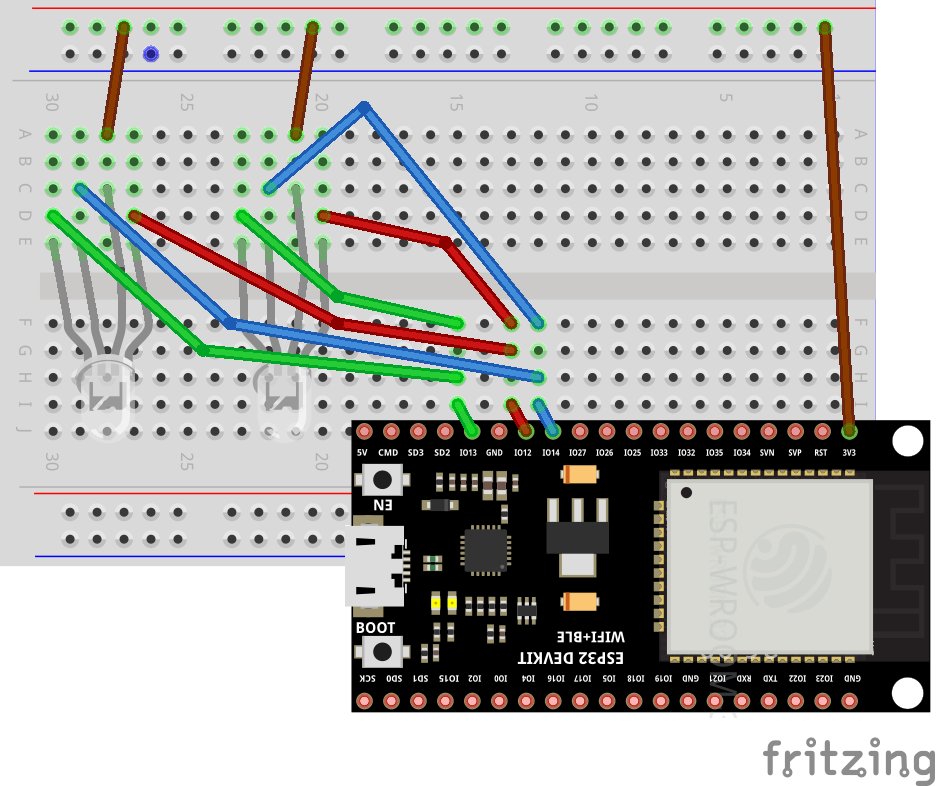
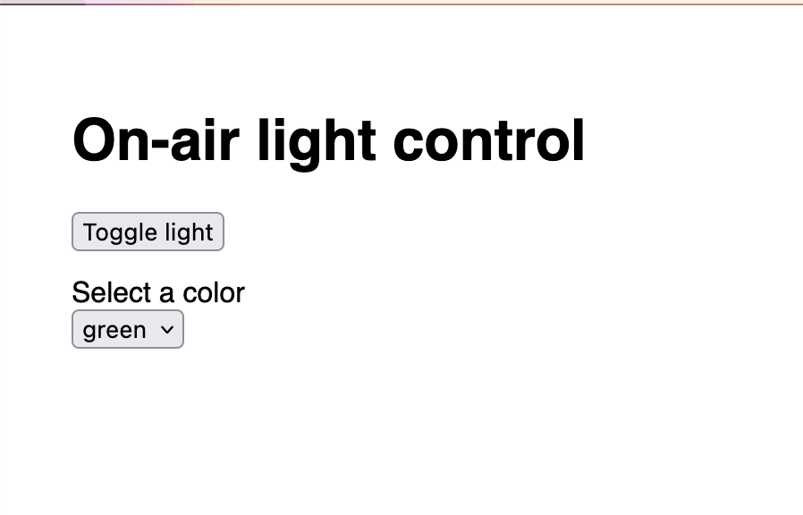
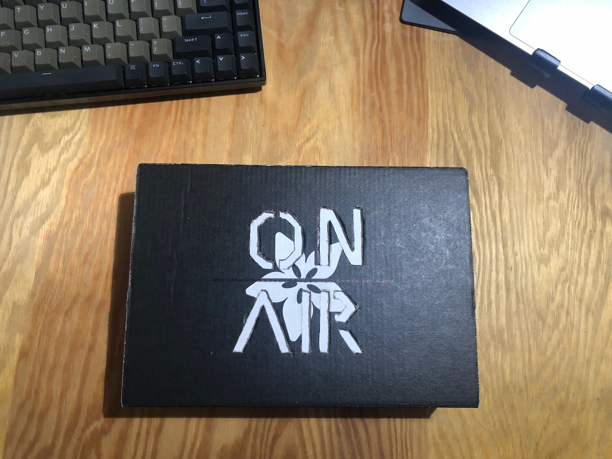
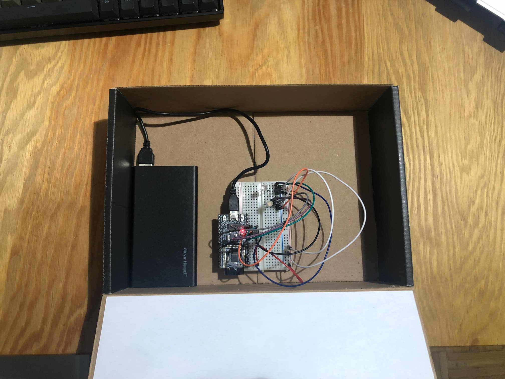
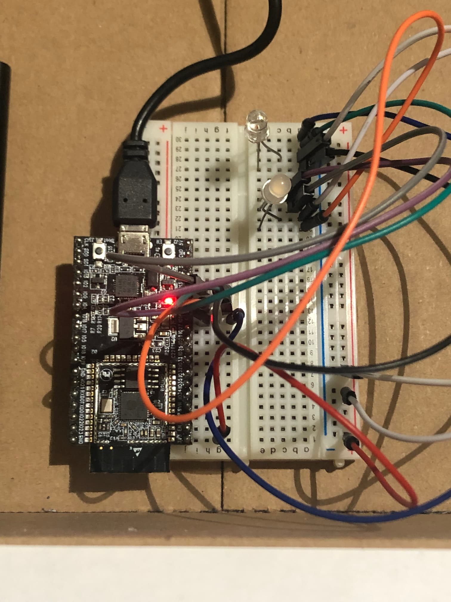

# On-Air Light

An offline-first IoT project on-air light for video meetings, using [ESP32](https://www.espressif.com/en/products/devkits/esp32-devkitc) & JavaScript with [Moddable XS](https://www.moddable.com/).

_While the materials demonstrate using an ESP32 development board, it is possible using an [ESP8266](https://www.adafruit.com/product/3046) with the same code (updated pins probably required) since Moddable runs on both platforms._

## Materials

- [ESP32](https://www.espressif.com/en/products/devkits/esp32-devkitc)
- [Breadboard](https://www.adafruit.com/product/64)
- [2 tri-color LEDs](https://www.adafruit.com/product/159)
- [male/male jumper wires](https://www.adafruit.com/product/759)
- slim USB battery pack
- Box (I used an [Adabox](https://www.adafruit.com/adabox/) container) 

## Wiring Diagram



## Setup

The dev environment was bootstrapped and managed using [`xs-dev`](https://github.com/HipsterBrown/xs-dev); however, that is not required if you want to go through the [Moddable set up instructions](https://github.com/Moddable-OpenSource/moddable/blob/public/documentation/Moddable%20SDK%20-%20Getting%20Started.md) manually or has been done previously.

After cloning this project repo, the `ssid` and `password` config fields in the `manifest.json` to match your WiFi details. The project does not require any Internet access (i.e. "offline-first"), just a shared network for local Web UI and HTTP API control.

After wiring the hardware materials together to match the documented diagram, the code can be uploaded to the board.

Using `xs-dev`:

```
xs-dev run --device esp32
```

Using [`mcconfig`](https://github.com/Moddable-OpenSource/moddable/blob/public/documentation/tools/tools.md#mcconfig):

```
mcconfig -d -m -p esp32
```

Once the LEDs are green for 3 seconds, the web UI should be available at `http://on-air.local/`.



## Deployed Project

External box:


Internal layout:


Breadboard wiring:

